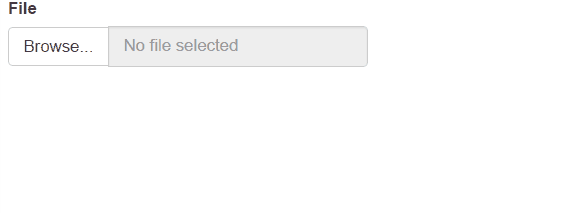
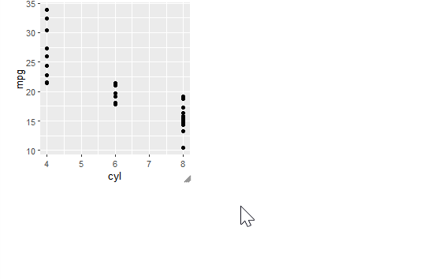
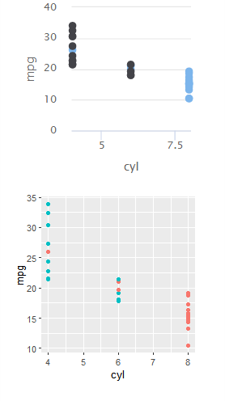
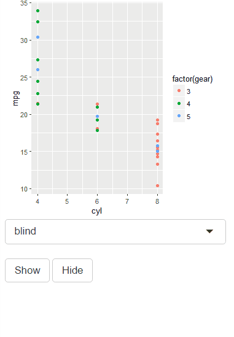
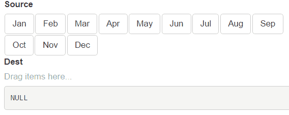
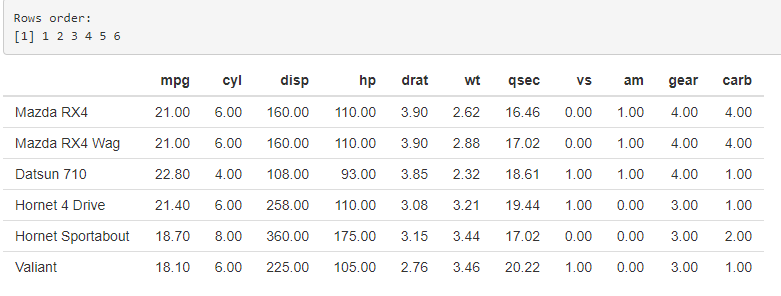
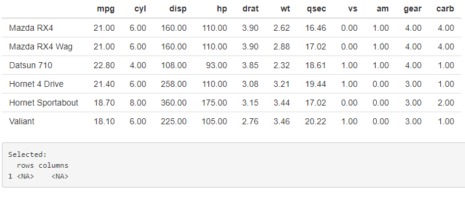

<!-- README.md is generated from README.Rmd. Please edit that file -->
shinyjqui
=========

[](https://travis-ci.org/Yang-Tang/shinyjqui) [](https://ci.appveyor.com/project/Yang-Tang/shinyjqui) [](https://cran.r-project.org/package=shinyjqui)

The shinyjqui package is an R wrapper for [jQuery UI](http://jqueryui.com/) javascript library. It allows user to easily add interactions and animation effects to a shiny app.

Installation
------------

You can install the stable version from CRAN, or the development version from github with:

``` r
# install from CRAN
install.packages('shinyjqui')

# for the development version
devtools::install_github("yang-tang/shinyjqui")
```

Usage
-----

``` r
# load packages
library(shiny)
library(shinyjqui)
library(ggplot2)
library(highcharter)
```

-   **Draggable:** Allow elements to be moved using the mouse

``` r
server <- function(input, output) {}

ui <- fluidPage(
  # for shinyjqui v0.2.0 or lower, please use jqui_draggabled instead 
  jqui_draggable(fileInput('file', 'File'))
)

shinyApp(ui, server)
```



-   **Resizable:** Change the size of an element using the mouse.

``` r
server <- function(input, output) {
  output$gg <- renderPlot({
    ggplot(mtcars, aes(x = cyl, y = mpg)) + geom_point()
  })
}

ui <- fluidPage(
  # for shinyjqui v0.2.0 or lower, please use jqui_resizable instead
  jqui_resizable(plotOutput('gg', width = '200px', height = '200px'))
)

shinyApp(ui, server)
```



-   **Sortable:** Reorder elements in a list or grid using the mouse.

``` r
server <- function(input, output) {
  output$hc <- renderHighchart({
    hchart(mtcars, "scatter", hcaes(x = cyl, y = mpg, group = factor(vs))) %>% 
      hc_legend(enabled = FALSE)
  })
  output$gg <- renderPlot({
    ggplot(mtcars, aes(x = cyl, y = mpg, color = factor(vs))) + 
      geom_point() + 
      theme(legend.position= "none")
  })
}

ui <- fluidPage(
  # for shinyjqui v0.2.0 or lower, please use jqui_sortabled instead
  jqui_sortable(div(id = 'plots',
                     highchartOutput('hc', width = '200px', height = '200px'),
                     plotOutput('gg', width = '200px', height = '200px')))
)

shinyApp(ui, server)
```



-   **Animation Effects:** Apply an animation effect to an element. Effects can also be used in hide or show.

``` r
server <- function(input, output) {
  observeEvent(input$show, {
    jqui_show('#gg', effect = input$effect)
  })
  
  observeEvent(input$hide, {
    jqui_hide('#gg', effect = input$effect)
  })
  
  output$gg <- renderPlot({
    ggplot(mtcars, aes(x = cyl, y = mpg, color = factor(gear))) +
      geom_point() +
      theme(plot.background = element_rect(fill = "transparent",colour = NA))
  }, bg = "transparent")
}

ui <- fluidPage(
  div(style = 'width: 400px; height: 400px',
      plotOutput('gg', width = '100%', height = '100%')),
  selectInput('effect', NULL, choices = get_jqui_effects()),
  actionButton('show', 'Show'),
  actionButton('hide', 'Hide')
)

shinyApp(ui, server)
```



-   **Classes transformation:** Add and remove class(es) to elements while animating all style changes.

``` r
server <- function(input, output) {

  current_class <- c()

  observe({
    input$class
    class_to_remove <- setdiff(current_class, input$class)
    class_to_add <- setdiff(input$class, current_class)
    current_class <<- input$class
    if(length(class_to_remove) > 0) {
      jqui_remove_class('#foo', paste(class_to_remove, collapse = ' '), duration = 1000)}
    if(length(class_to_add) > 0) {
      jqui_add_class('#foo', paste(class_to_add, collapse = ' '), duration = 1000)}
  })

}

ui <- fluidPage(

  tags$head(
    tags$style(
      HTML('.class1 { width: 410px; height: 100px; }
            .class2 { text-indent: 40px; letter-spacing: .2em; }
            .class3 { padding: 30px; margin: 10px; }
            .class4 { font-size: 1.1em; }')
    )
  ),

  div(id = 'foo', 'Etiam libero neque, luctus a, eleifend nec, semper at, lorem. Sed pede.'),
  hr(),
  checkboxGroupInput('class', 'Class',
                     choices = list(`width: 410px; height: 100px;` = 'class1',
                                    `text-indent: 40px; letter-spacing: .2em;` = 'class2',
                                    `padding: 30px; margin: 10px;` = 'class3',
                                    `font-size: 1.1em;` = 'class4'))


)

shinyApp(ui, server)
```


-   **orderInput():** Display a list of items. Their order can be changed by drag and drop.

``` r
server <- function(input, output) {
  output$order <- renderPrint({ print(input$dest_order) })
}

ui <- fluidPage(
  orderInput('source', 'Source', items = month.abb,
             as_source = TRUE, connect = 'dest'),
  orderInput('dest', 'Dest', items = NULL, placeholder = 'Drag items here...'),
  verbatimTextOutput('order')
)

shinyApp(ui, server)
```



-   **sortableTableOutput():** Render a HTML table with sortable rows.

``` r
ui <- fluidPage(
  verbatimTextOutput("index"),
  sortableTableOutput("tbl")
)

server <- function(input, output) {
  output$index <- renderPrint({
    cat("Row index:\n")
    input$tbl_row_index
  })
  output$tbl <- renderTable(head(mtcars), rownames = TRUE)
}

shinyApp(ui, server)
```



-   **selectableTableOutput():** Render a HTML table with selectable rows or cells.

``` r
ui <- fluidPage(
  selectableTableOutput("tbl", selection_mode = "cell"),
  verbatimTextOutput("selected")
)

server <- function(input, output) {
  output$selected <- renderPrint({
    cat("Selected:\n")
    input$tbl_selected
  })
  output$tbl <- renderTable(head(mtcars), rownames = TRUE)
}

shinyApp(ui, server)
```


